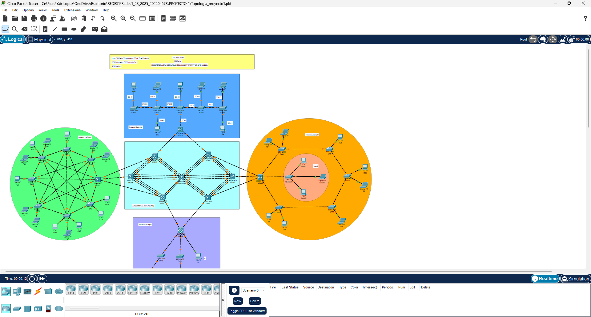

Manual Tecnico

Universidad de San Carlos de Guatemala
Escuela de Ciencias y Sistemas
Redes de Computadores 1
Estiben Yair Lopez Leveron
202204578

###### Topologia de Red



# Vlans y Direccionamiento Ip

# Configuracion de los Switches

**configuracion de vtp**

Área central:

Switch Multicapa (Servidor VTP)

```Cisco
enable
configure terminal
  hostname SERVIDOR

  vtp mode server
  vtp version 2
  vtp domain C5_FIUComm
exit

write

```

Switches Clientes (MSW1 – MSW6)

```Cisco
enable
configure terminal
  hostname MSW1
  vtp mode client
  vtp version 2
  vtp domain C5_FIUComm
exit
write

enable
configure terminal
  hostname MSW2
  vtp mode client
  vtp version 2
  vtp domain C5_FIUComm
exit
write

enable
configure terminal
  hostname MSW3
  vtp mode client
  vtp version 2
  vtp domain C5_FIUComm
exit
write

enable
configure terminal
  hostname MSW4
  vtp mode client
  vtp version 2
  vtp domain C5_FIUComm
exit
write

enable
configure terminal
  hostname MSW5
  vtp mode client
  vtp version 2
  vtp domain C5_FIUComm
exit
write

enable
configure terminal
  hostname MSW6
  vtp mode client
  vtp version 2
  vtp domain C5_FIUComm
exit
write

```

Área: Gerencia
Clientes
Switches: SW13, SW14, SW15, SW16, SW17, MSW10

```Cisco
enable
configure terminal
  hostname SW13
  vtp mode client
  vtp version 2
  vtp domain C5_FIUComm
exit
write

enable
configure terminal
  hostname SW14
  vtp mode client
  vtp version 2
  vtp domain C5_FIUComm
exit
write

enable
configure terminal
  hostname SW15
  vtp mode client
  vtp version 2
  vtp domain C5_FIUComm
exit
write

enable
configure terminal
  hostname SW16
  vtp mode client
  vtp version 2
  vtp domain C5_FIUComm
exit
write

enable
configure terminal
  hostname SW17
  vtp mode client
  vtp version 2
  vtp domain C5_FIUComm
exit
write

enable
configure terminal
  hostname MSW10
  vtp mode client
  vtp version 2
  vtp domain C5_FIUComm
exit
write

```


Área: Infraestructura IT
Cliente
Switches: SW8, SW9, SW10, SW11, SW12, MSW8
Switch Transparente: Switch19

```Cisco
enable
configure terminal
  hostname SW8
  vtp mode client
  vtp version 2
  vtp domain C5_FIUComm
exit
write

enable
configure terminal
  hostname SW9
  vtp mode client
  vtp version 2
  vtp domain C5_FIUComm
exit
write

enable
configure terminal
  hostname SW10
  vtp mode client
  vtp version 2
  vtp domain C5_FIUComm
exit
write

enable
configure terminal
  hostname SW11
  vtp mode client
  vtp version 2
  vtp domain C5_FIUComm
exit
write

enable
configure terminal
  hostname SW12
  vtp mode client
  vtp version 2
  vtp domain C5_FIUComm
exit
write

enable
configure terminal
  hostname MSW8
  vtp mode client
  vtp version 2
  vtp domain C5_FIUComm
exit
write

! Switch en modo transparente
enable
configure terminal
  hostname Switch19
  vtp mode transparent
  vtp version 2
  vtp domain C5_FIUComm
exit
write
```


Área: Análisis de Datos
cliente
Switches: SW1 – SW7, MSW7

```Cisco
enable
configure terminal
  hostname SW1
  vtp mode client
  vtp version 2
  vtp domain C5_FIUComm
exit
write

enable
configure terminal
  hostname SW2
  vtp mode client
  vtp version 2
  vtp domain C5_FIUComm
exit
write

enable
configure terminal
  hostname SW3
  vtp mode client
  vtp version 2
  vtp domain C5_FIUComm
exit
write

enable
configure terminal
  hostname SW4
  vtp mode client
  vtp version 2
  vtp domain C5_FIUComm
exit
write

enable
configure terminal
  hostname SW5
  vtp mode client
  vtp version 2
  vtp domain C5_FIUComm
exit
write

enable
configure terminal
  hostname SW6
  vtp mode client
  vtp version 2
  vtp domain C5_FIUComm
exit
write

enable
configure terminal
  hostname SW7
  vtp mode client
  vtp version 2
  vtp domain C5_FIUComm
exit
write

enable
configure terminal
  hostname MSW7
  vtp mode client
  vtp version 2
  vtp domain C5_FIUComm
exit
write

```


Área: Redacción digital (RD)
cliente
Switches: SW18, SW19, SW20, MSW9

```Cisco
enable
configure terminal
  hostname SW18
  vtp mode client
  vtp version 2
  vtp domain C5_FIUComm
exit
write

enable
configure terminal
  hostname SW19
  vtp mode client
  vtp version 2
  vtp domain C5_FIUComm
exit
write

enable
configure terminal
  hostname SW20
  vtp mode client
  vtp version 2
  vtp domain C5_FIUComm
exit
write

enable
configure terminal
  hostname MSW9
  vtp mode client
  vtp version 2
  vtp domain C5_FIUComm
exit
write

```

# Pruebas de Conectividad

# Presupuesto
