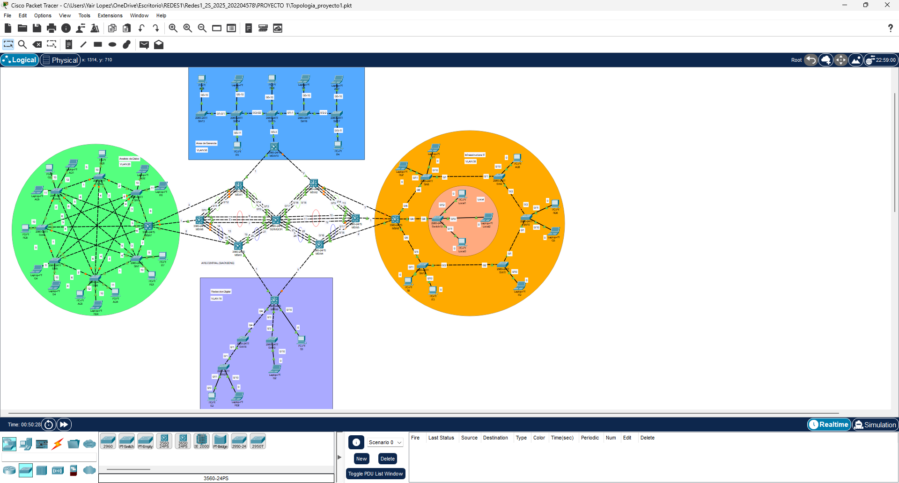
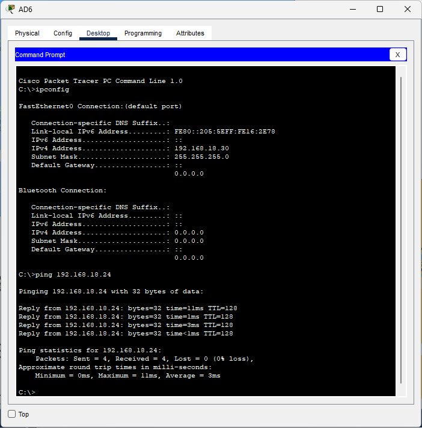
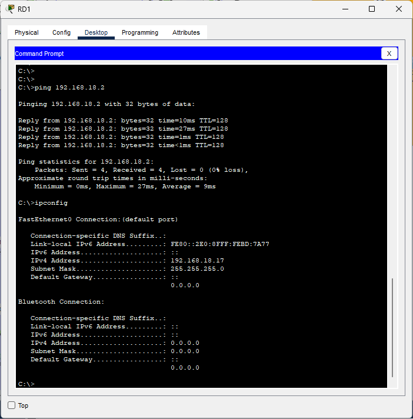
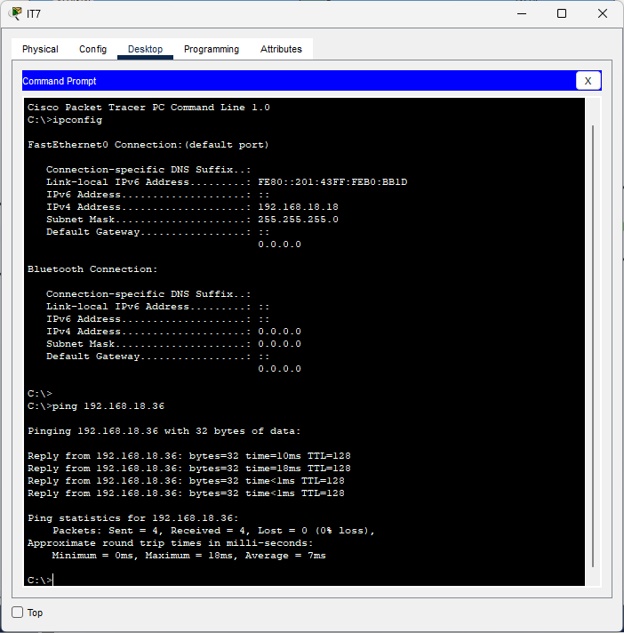
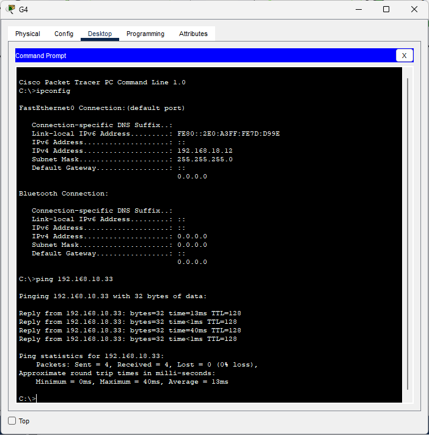
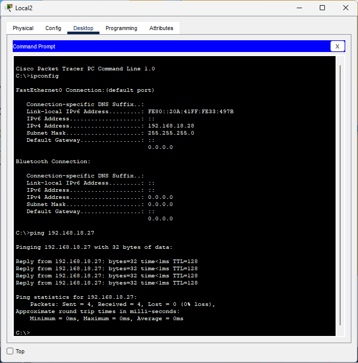

Manual Tecnico

Universidad de San Carlos de Guatemala
Escuela de Ciencias y Sistemas
Redes de Computadores 1
Estiben Yair Lopez Leveron
202204578

## Topologia de Red



# Vlans y Direccionamiento Ip

Lista de configuracion de ips y vlans

## Redaccion Digital


| Departamento      | VLAN | IP              | Dispositivo | Nombre del dispositivo |
| ----------------- | ---- | --------------- | ----------- | ---------------------- |
| Redaccion digital | 18   | 192.168.18.1/24 | PC          | S2                     |
| Redaccion digital | 18   | 192.168.18.2/24 | LAPTOP      | RD2                    |
| Redaccion digital | 18   | 192.168.18.3/24 | PC          | G2                     |
| Redaccion digital | 18   | 192.168.18.4/24 | LAPTOP      | S3                     |

## Analisis de Datos


| Departamento      | VLAN | IP               | Dispositivo | Nombre del dispositivo |
| ----------------- | ---- | ---------------- | ----------- | ---------------------- |
| Analisis de Datos | 28   | 192.168.18.5/24  | LAPTOP      | IT8                    |
| Analisis de Datos | 28   | 192.168.18.6/24  | LAPTOP      | AD2                    |
| Analisis de Datos | 28   | 192.168.18.7/24  | PC          | RD3                    |
| Analisis de Datos | 28   | 192.168.18.8/24  | LAPTOP      | AD1                    |
| Analisis de Datos | 28   | 192.168.18.9/24  | PC          | G3                     |
| Analisis de Datos | 28   | 192.168.18.10/24 | LAPTOP      | AD5                    |
| Analisis de Datos | 28   | 192.168.18.11/24 | PC          | RD5                    |
| Analisis de Datos | 28   | 192.168.18.12/24 | LAPTOP      | G4                     |
| Analisis de Datos | 28   | 192.168.18.13/24 | LAPTOP      | S4                     |
| Analisis de Datos | 28   | 192.168.18.14/24 | PC          | AD3                    |
| Analisis de Datos | 28   | 192.168.18.15/24 | LAPTOP      | RD4                    |
| Analisis de Datos | 28   | 192.168.18.16/24 | PC          | AD4                    |
| Analisis de Datos | 28   | 192.168.18.17/24 | PC          | RD1                    |
| Analisis de Datos | 28   | 192.168.18.18/24 | PC          | IT7                    |

## Infraestructura IT


| Departamento       | VLAN | IP               | Dispositivo | Nombre del dispositivo |
| ------------------ | ---- | ---------------- | ----------- | ---------------------- |
| Infraestructura IT | 38   | 192.168.18.19/24 | PC          | S5                     |
| Infraestructura IT | 38   | 192.168.18.20/24 | PC          | IT3                    |
| Infraestructura IT | 38   | 192.168.18.21/24 | LAPTOP      | IT2                    |
| Infraestructura IT | 38   | 192.168.18.22/24 | LAPTOP      | G2                     |
| Infraestructura IT | 38   | 192.168.18.23/24 | PC          | RD6                    |
| Infraestructura IT | 38   | 192.168.18.24/24 | PC          | AD8                    |
| Infraestructura IT | 38   | 192.168.18.25/24 | LAPTOP      | IT1                    |
| Infraestructura IT | 38   | 192.168.18.26/24 | LAPTOP      | RD7                    |

## Area Local de Infraestructura IT


| Departamento | VLAN | IP               | Dispositivo | Nombre del dispositivo |
| ------------ | ---- | ---------------- | ----------- | ---------------------- |
| Local        | 38   | 192.168.18.27/24 | PC          | Local1                 |
| Local        | 38   | 192.168.18.28/24 | LAPTOP      | Local2                 |
| Local        | 38   | 192.168.18.29/24 | PC          | Local3                 |

## Area de Gerencia


| Departamento     | VLAN | IP               | Dispositivo | Nombre del dispositivo |
| ---------------- | ---- | ---------------- | ----------- | ---------------------- |
| Area de Gerencia | 58   | 192.168.18.30/24 | PC          | AD6                    |
| Area de Gerencia | 58   | 192.168.18.31/24 | LAPTOP      | S1                     |
| Area de Gerencia | 58   | 192.168.18.32/24 | PC          | RD8                    |
| Area de Gerencia | 58   | 192.168.18.33/24 | LAPTOP      | G1                     |
| Area de Gerencia | 58   | 192.168.18.34/24 | LAPTOP      | AD7                    |
| Area de Gerencia | 58   | 192.168.18.35/24 | PC          | IT4                    |
| Area de Gerencia | 58   | 192.168.18.36/24 | PC          | IT5                    |

# Configuracion de los Switches

**configuracion de vtp**

Área central:
Switch Multicapa (Servidor VTP)

```Cisco
enable
configure terminal
  hostname SERVIDOR

  vtp mode server
  vtp version 2
  vtp domain C5_FIUComm
exit

write

```

Switches Clientes (MSW1 – MSW6)

```Cisco
enable
configure terminal
  hostname MSW1
  vtp mode client
  vtp version 2
  vtp domain C5_FIUComm
exit
write

enable
configure terminal
  hostname MSW2
  vtp mode client
  vtp version 2
  vtp domain C5_FIUComm
exit
write

enable
configure terminal
  hostname MSW3
  vtp mode client
  vtp version 2
  vtp domain C5_FIUComm
exit
write

enable
configure terminal
  hostname MSW4
  vtp mode client
  vtp version 2
  vtp domain C5_FIUComm
exit
write

enable
configure terminal
  hostname MSW5
  vtp mode client
  vtp version 2
  vtp domain C5_FIUComm
exit
write

enable
configure terminal
  hostname MSW6
  vtp mode client
  vtp version 2
  vtp domain C5_FIUComm
exit
write

```

Área: Gerencia
Clientes
Switches: SW13, SW14, SW15, SW16, SW17, MSW10

```Cisco
enable
configure terminal
  hostname SW13
  vtp mode client
  vtp version 2
  vtp domain C5_FIUComm
exit
write

enable
configure terminal
  hostname SW14
  vtp mode client
  vtp version 2
  vtp domain C5_FIUComm
exit
write

enable
configure terminal
  hostname SW15
  vtp mode client
  vtp version 2
  vtp domain C5_FIUComm
exit
write

enable
configure terminal
  hostname SW16
  vtp mode client
  vtp version 2
  vtp domain C5_FIUComm
exit
write

enable
configure terminal
  hostname SW17
  vtp mode client
  vtp version 2
  vtp domain C5_FIUComm
exit
write

enable
configure terminal
  hostname MSW10
  vtp mode client
  vtp version 2
  vtp domain C5_FIUComm
exit
write

```

Área: Infraestructura IT
Cliente
Switches: SW8, SW9, SW10, SW11, SW12, MSW8
Switch Transparente: Switch19

```Cisco
enable
configure terminal
  hostname SW8
  vtp mode client
  vtp version 2
  vtp domain C5_FIUComm
exit
write

enable
configure terminal
  hostname SW9
  vtp mode client
  vtp version 2
  vtp domain C5_FIUComm
exit
write

enable
configure terminal
  hostname SW10
  vtp mode client
  vtp version 2
  vtp domain C5_FIUComm
exit
write

enable
configure terminal
  hostname SW11
  vtp mode client
  vtp version 2
  vtp domain C5_FIUComm
exit
write

enable
configure terminal
  hostname SW12
  vtp mode client
  vtp version 2
  vtp domain C5_FIUComm
exit
write

enable
configure terminal
  hostname MSW8
  vtp mode client
  vtp version 2
  vtp domain C5_FIUComm
exit
write

! Switch en modo transparente
enable
configure terminal
  hostname Switch19
  vtp mode transparent
  vtp version 2
  vtp domain C5_FIUComm
exit
write
```

Área: Análisis de Datos
cliente
Switches: SW1 – SW7, MSW7

```Cisco
enable
configure terminal
  hostname SW1
  vtp mode client
  vtp version 2
  vtp domain C5_FIUComm
exit
write

enable
configure terminal
  hostname SW2
  vtp mode client
  vtp version 2
  vtp domain C5_FIUComm
exit
write

enable
configure terminal
  hostname SW3
  vtp mode client
  vtp version 2
  vtp domain C5_FIUComm
exit
write

enable
configure terminal
  hostname SW4
  vtp mode client
  vtp version 2
  vtp domain C5_FIUComm
exit
write

enable
configure terminal
  hostname SW5
  vtp mode client
  vtp version 2
  vtp domain C5_FIUComm
exit
write

enable
configure terminal
  hostname SW6
  vtp mode client
  vtp version 2
  vtp domain C5_FIUComm
exit
write

enable
configure terminal
  hostname SW7
  vtp mode client
  vtp version 2
  vtp domain C5_FIUComm
exit
write

enable
configure terminal
  hostname MSW7
  vtp mode client
  vtp version 2
  vtp domain C5_FIUComm
exit
write

```

Área: Redacción digital (RD)
cliente
Switches: SW18, SW19, SW20, MSW9

```Cisco
enable
configure terminal
  hostname SW18
  vtp mode client
  vtp version 2
  vtp domain C5_FIUComm
exit
write

enable
configure terminal
  hostname SW19
  vtp mode client
  vtp version 2
  vtp domain C5_FIUComm
exit
write

enable
configure terminal
  hostname SW20
  vtp mode client
  vtp version 2
  vtp domain C5_FIUComm
exit
write

enable
configure terminal
  hostname MSW9
  vtp mode client
  vtp version 2
  vtp domain C5_FIUComm
exit
write

```
## configuracion de STP

switch servidor
```
enable 
configure terminal
 spanning-tree vlan 1,18,28,38,48,58 root primary   
end
write
```

swtich clientes (todos los del area central menos el servidor)
```
enable 
configure terminal
 spanning-tree vlan 1,18,28,38,48,58 root secondary
end
write
```

Para los otros switches
```
enable 
configure terminal
 spanning-tree vlan 1,18,28,38,48,58 priority 32768
end
write
```

## swtich transpartente 
crea vlan 
```
enable
configure terminal
 vlan 78
  name Recepcion
end
write
```

## configuracion de Etherchannels

switch servidor

```
!configuracion rojo LACP de servidor a MSW6
enable 
configure terminal
! Enlaces físicos
interface range fa0/6 - 8
 switchport
 switchport trunk encapsulation dot1q
 switchport mode trunk
 channel-group 1 mode active
exit

! Interfaz lógica del EtherChannel
interface port-channel 1
 switchport
 switchport trunk encapsulation dot1q
 switchport mode trunk
 switchport trunk allowed vlan 18,28,38,48,58
exit


!configuracion rojo LACP de servidor a MSW5
enable 
configure terminal
! Enlaces físicos
interface range fa0/10 - 12
 switchport
 switchport trunk encapsulation dot1q
 switchport mode trunk
 channel-group 2 mode active
exit

! Interfaz lógica del EtherChannel
interface port-channel 2
 switchport
 switchport trunk encapsulation dot1q
 switchport mode trunk
 switchport trunk allowed vlan 18,28,38,48,58
exit


!configuracion verde LACP de servidor a MSW1
enable 
configure terminal
! Enlaces físicos
interface range fa0/13 - 15
 switchport
 switchport trunk encapsulation dot1q
 switchport mode trunk
 channel-group 3 mode active
exit

! Interfaz lógica del EtherChannel
interface port-channel 3
 switchport
 switchport trunk encapsulation dot1q
 switchport mode trunk
 switchport trunk allowed vlan 18,28,38,48,58
exit

!configuracion verde LACP de servidor a MSW1
enable 
configure terminal
! Enlaces físicos
interface range fa0/16 - 18
 switchport
 switchport trunk encapsulation dot1q
 switchport mode trunk
 channel-group 4 mode active
exit

! Interfaz lógica del EtherChannel
interface port-channel 4
 switchport
 switchport trunk encapsulation dot1q
 switchport mode trunk
 switchport trunk allowed vlan 18,28,38,48,58
exit


!configuracion azul PagP de servidor a MSW3
enable
configure terminal
interface range fa0/19 - 21
 switchport
 switchport trunk encapsulation dot1q
 switchport mode trunk
 channel-group 5 mode desirable   
exit

! Port-channel lógico
interface port-channel 5
 switchport
 switchport trunk encapsulation dot1q
 switchport mode trunk
 switchport trunk allowed vlan 18,28,38,48,58
exit


!configuracion azul PagP de servidor a MSW4
enable
configure terminal
interface range fa0/22 - 24
 switchport
 switchport trunk encapsulation dot1q
 switchport mode trunk
 channel-group 6 mode desirable   
exit

! Port-channel lógico
interface port-channel 6
 switchport
 switchport trunk encapsulation dot1q
 switchport mode trunk
 switchport trunk allowed vlan 18,28,38,48,58
exit


```

switch MSW4

```
enable
configure terminal
interface range fa0/22 - 24
 switchport
 switchport trunk encapsulation dot1q
 switchport mode trunk
 channel-group 1 mode desirable   
exit

! Port-channel lógico
interface port-channel 1
 switchport
 switchport trunk encapsulation dot1q
 switchport mode trunk
 switchport trunk allowed vlan 18,28,38,48,58
exit


!configuracion azul PagP de MSW4 a MSW5
enable
configure terminal
interface range fa0/16 - 18
 switchport
 switchport trunk encapsulation dot1q
 switchport mode trunk
 channel-group 2 mode desirable   
exit

! Port-channel lógico
interface port-channel 2
 switchport
 switchport trunk encapsulation dot1q
 switchport mode trunk
 switchport trunk allowed vlan 18,28,38,48,58
exit

```

switch MSW3

```
!configuracion azul PagP de MSW3 a SERVIDOR
enable
configure terminal
interface range fa0/19 - 21
 switchport
 switchport trunk encapsulation dot1q
 switchport mode trunk
 channel-group 1 mode desirable   
exit

! Port-channel lógico
interface port-channel 1
 switchport
 switchport trunk encapsulation dot1q
 switchport mode trunk
 switchport trunk allowed vlan 18,28,38,48,58
exit


!configuracion azul PagP de MSW3 a MSW6
enable
configure terminal
interface range fa0/13 - 15
 switchport
 switchport trunk encapsulation dot1q
 switchport mode trunk
 channel-group 2 mode desirable   
exit

! Port-channel lógico
interface port-channel 2
 switchport
 switchport trunk encapsulation dot1q
 switchport mode trunk
 switchport trunk allowed vlan 18,28,38,48,58
exit

```

switch MSW1

```
!configuracion verde LACP de  MSW1 a servidor
enable 
configure terminal
! Enlaces físicos
interface range fa0/13 - 15
 switchport
 switchport trunk encapsulation dot1q
 switchport mode trunk
 channel-group 3 mode active
exit

! Interfaz lógica del EtherChannel
interface port-channel 3
 switchport
 switchport trunk encapsulation dot1q
 switchport mode trunk
 switchport trunk allowed vlan 18,28,38,48,58
exit


!configuracion verde LACP de  MSW1 a MSW6
enable 
configure terminal
! Enlaces físicos
interface range fa0/10 - 12
 switchport
 switchport trunk encapsulation dot1q
 switchport mode trunk
 channel-group 2 mode active
exit

! Interfaz lógica del EtherChannel
interface port-channel 2
 switchport
 switchport trunk encapsulation dot1q
 switchport mode trunk
 switchport trunk allowed vlan 18,28,38,48,58
exit

```

switch MSW2

```
!configuracion verde LACP de servidor a MSW1
enable 
configure terminal
! Enlaces físicos
interface range fa0/16 - 18
 switchport
 switchport trunk encapsulation dot1q
 switchport mode trunk
 channel-group 1 mode active
exit

! Interfaz lógica del EtherChannel
interface port-channel 1
 switchport
 switchport trunk encapsulation dot1q
 switchport mode trunk
 switchport trunk allowed vlan 18,28,38,48,58
exit


!configuracion verde LACP de MSW2 A MSW5
enable 
configure terminal
! Enlaces físicos
interface range fa0/13 - 15
 switchport
 switchport trunk encapsulation dot1q
 switchport mode trunk
 channel-group 2 mode active
exit

! Interfaz lógica del EtherChannel
interface port-channel 2
 switchport
 switchport trunk encapsulation dot1q
 switchport mode trunk
 switchport trunk allowed vlan 18,28,38,48,58
exit


```

switch MSW6

```
!configuracion rojo LACP de MSW6 a servidor
enable 
configure terminal
! Enlaces físicos
interface range fa0/6 - 8
 switchport
 switchport trunk encapsulation dot1q
 switchport mode trunk
 channel-group 1 mode active
exit

! Interfaz lógica del EtherChannel
interface port-channel 1
 switchport
 switchport trunk encapsulation dot1q
 switchport mode trunk
 switchport trunk allowed vlan 18,28,38,48,58
exit


!configuracion verde LACP de MSW6 a MSW1
enable 
configure terminal
! Enlaces físicos
interface range fa0/10 - 12
 switchport
 switchport trunk encapsulation dot1q
 switchport mode trunk
 channel-group 2 mode active
exit

! Interfaz lógica del EtherChannel
interface port-channel 2
 switchport
 switchport trunk encapsulation dot1q
 switchport mode trunk
 switchport trunk allowed vlan 18,28,38,48,58
exit


!configuracion azul PagP de MSW3 a SERVIDOR
enable
configure terminal
interface range fa0/13 - 15
 switchport
 switchport trunk encapsulation dot1q
 switchport mode trunk
 channel-group 3 mode desirable   
exit

! Port-channel lógico
interface port-channel 3
 switchport
 switchport trunk encapsulation dot1q
 switchport mode trunk
 switchport trunk allowed vlan 18,28,38,48,58
exit

```

switch MSW5

```
!configuracion rojo LACP de servidor a MSW6
enable 
configure terminal
! Enlaces físicos
interface range fa0/10 - 12
 switchport
 switchport trunk encapsulation dot1q
 switchport mode trunk
 channel-group 1 mode active
exit

! Interfaz lógica del EtherChannel
interface port-channel 1
 switchport
 switchport trunk encapsulation dot1q
 switchport mode trunk
 switchport trunk allowed vlan 18,28,38,48,58
exit

!configuracion verde LACP de MS26 a MSW2
enable 
configure terminal
! Enlaces físicos
interface range fa0/13 - 15
 switchport
 switchport trunk encapsulation dot1q
 switchport mode trunk
 channel-group 2 mode active
exit

! Interfaz lógica del EtherChannel
interface port-channel 2
 switchport
 switchport trunk encapsulation dot1q
 switchport mode trunk
 switchport trunk allowed vlan 18,28,38,48,58
exit


!configuracion azul PagP de MSW5 a MSW4
enable
configure terminal
interface range fa0/16 - 18
 switchport
 switchport trunk encapsulation dot1q
 switchport mode trunk
 channel-group 3 mode desirable   
exit

! Port-channel lógico
interface port-channel 3
 switchport
 switchport trunk encapsulation dot1q
 switchport mode trunk
 switchport trunk allowed vlan 18,28,38,48,58
exit

```

* Configuracion de Vlans en el switch Servidor
  creacion de vlans Switch Servidor
  carnet 202204578
  como mi carnet termina en 8 se le puso al final de la vlan

```
enable
config terminal

vlan 18
 name RedaccionDigital
 exit

vlan 28
 name AnalisisDatos
 exit

vlan 38
 name InfraestructuraIT
 exit

vlan 48
 name Seguridad
 exit

vlan 58
 name Gerencia
 exit

exit
write
```

## Banners MOTD (5 switches, uno por área)

switch de bienvenida

switch SW1 (Anilisis de Datos)
```
enable
configure terminal
 hostname SW1
 banner motd #
 Bienvenido a Analisis de Datos - FIUComm_202204578
 #
end
write

```

switch SW18 (Redaccion Digital)

```
enable
configure terminal
 hostname SW18
 banner motd #
 Bienvenido a Redaccion Digital - FIUComm_202204578
 #
end
write

```


switch SW8 (Infraestructura IT)

```
enable
configure terminal
 hostname SW8
 banner motd #
 Bienvenido a Infraestructura IT - FIUComm_202204578
 #
end
write

```


switch SW8 (Area de Gerencia)

```
enable
configure terminal
 hostname SW15
 banner motd #
 Bienvenido a Area de Gerencia - FIUComm_202204578
 #
end
write
```

switch SW8 (Area central Backone)

```
enable
configure terminal
 banner motd #
 Bienvenido a Area Central Backone - FIUComm_202204578
 #
end
write

```

switch SW19 (Area Local)

```
enable
configure terminal
 banner motd #
 Bienvenido a Area Local - FIUComm_202204578
 #
end
write

```


## configuracion para conexiones

switch MSW1
```
enable
configure terminal
interface range fa0/1
 switchport trunk encapsulation dot1q
 switchport mode trunk
 switchport trunk allowed vlan 18,28,38,48,58
exit
end
write


enable
configure terminal
interface range fa0/3
 switchport trunk encapsulation dot1q
 switchport mode trunk
 switchport trunk allowed vlan 18,28,38,48,58
exit
end
write
```

switch MSW2
```
enable
configure terminal
interface range fa0/2
 switchport trunk encapsulation dot1q
 switchport mode trunk
 switchport trunk allowed vlan 18,28,38,48,58
exit
end
write


enable
configure terminal
interface range fa0/3
 switchport trunk encapsulation dot1q
 switchport mode trunk
 switchport trunk allowed vlan 18,28,38,48,58
exit
end
write
```


switch MSW3
```
enable
configure terminal
interface range fa0/1
 switchport trunk encapsulation dot1q
 switchport mode trunk
 switchport trunk allowed vlan 18,28,38,48,58
exit
exit
write


enable
configure terminal
interface range fa0/2
 switchport trunk encapsulation dot1q
 switchport mode trunk
 switchport trunk allowed vlan 18,28,38,48,58
exit
end
write


enable
configure terminal
interface range fa0/2
 switchport trunk encapsulation dot1q
 switchport mode trunk
 switchport trunk allowed vlan 18,28,38,48,58
exit
end
write

```

switch MSW4
```
enable
configure terminal
interface range fa0/5
 switchport trunk encapsulation dot1q
 switchport mode trunk
 switchport trunk allowed vlan 18,28,38,48,58
exit
exit
write
```


switch MSW5
```
enable
configure terminal
interface range fa0/1
 switchport trunk encapsulation dot1q
 switchport mode trunk
 switchport trunk allowed vlan 18,28,38,48,58
exit
end
write
```

switch MSW6
```
enable
configure terminal
interface range fa0/1
 switchport trunk encapsulation dot1q
 switchport mode trunk
 switchport trunk allowed vlan 18,28,38,48,58
exit
end
write
```
switch MSW7
```
enable
configure terminal
interface range fa0/1-3
 switchport trunk encapsulation dot1q
 switchport mode trunk
 switchport trunk allowed vlan 18,28,38,48,58
exit
end
write


enable
configure terminal
interface range fa0/4-8
 switchport trunk encapsulation dot1q
 switchport mode trunk
 switchport trunk allowed vlan 18,28,38,48,58
exit
end
write


```


switch MSW8
```
enable
configure terminal
interface range fa0/1 - 3
 switchport trunk encapsulation dot1q
 switchport mode trunk
 switchport trunk allowed vlan 18,28,38,48,58
exit
end
write


enable
configure terminal
interface range fa0/4 - 6
 switchport trunk encapsulation dot1q
 switchport mode trunk
 switchport trunk allowed vlan 18,28,38,48,58
exit
end
write


enable
configure terminal
interface range fa0/4
 switchport trunk encapsulation dot1q
 switchport mode trunk
 switchport trunk allowed vlan 18,28,38,48,58
exit
end
write
```

switch MSW10
```
enable
configure terminal
interface range fa0/1 - 2
 switchport trunk encapsulation dot1q
 switchport mode trunk
 switchport trunk allowed vlan 18,28,38,48,58
exit
end
write

enable
configure terminal
interface range fa0/3
 switchport trunk encapsulation dot1q
 switchport mode trunk
 switchport trunk allowed vlan 18,28,38,48,58
exit
end
write
```

switch SW1
```
enable
configure terminal
 interface range fa0/1
  switchport mode trunk
  switchport trunk allowed vlan 18,28,38,48,58
 exit
end
write

enable
configure terminal
 interface range fa0/8
  switchport mode trunk
  switchport trunk allowed vlan 18,28,38,48,58
 exit
end
write

enable
configure terminal
 interface range fa0/3 
  switchport mode trunk
  switchport trunk allowed vlan 18,28,38,48,58
 exit
end
write

enable
configure terminal
 interface range fa0/4
  switchport mode trunk
  switchport trunk allowed vlan 18,28,38,48,58
 exit
end
write


enable
configure terminal
 interface range fa0/6
  switchport mode trunk
  switchport trunk allowed vlan 18,28,38,48,58
 exit
end
write


enable
configure terminal
 interface fa0/11
  description Latpop IT8 - Infraestructura
  switchport mode access
  switchport access vlan 38
 exit
end
write


enable
configure terminal
 interface fa0/10
  description PC AD2 - AnalisisdeDatos
  switchport mode access
  switchport access vlan 28
 exit
end
write

```

switch SW2
```
enable
configure terminal
 interface range fa0/1 - 2
  switchport mode trunk
  switchport trunk allowed vlan 18,28,38,48,58
 exit
end
write

enable
configure terminal
 interface range fa0/3 - 5
  switchport mode trunk
  switchport trunk allowed vlan 18,28,38,48,58
 exit
end
write


enable
configure terminal
 interface fa0/10
  description PC RD3 - RedaccionDigital
  switchport mode access
  switchport access vlan 18
 exit
end
write
```


switch SW3
```
enable
configure terminal
 interface range fa0/1 - 2
  switchport mode trunk
  switchport trunk allowed vlan 18,28,38,48,58
 exit
end
write

enable
configure terminal
 interface range fa0/5
  switchport mode trunk
  switchport trunk allowed vlan 18,28,38,48,58
 exit
end
write


enable
configure terminal
 interface fa0/10
  description PC G3 - Gerencia
  switchport mode access
  switchport access vlan 58
 exit
end
write


enable
configure terminal
 interface fa0/11
  description Laptop AD5 - Analisis de Datos
  switchport mode access
  switchport access vlan 28
 exit
end
write


enable
configure terminal
 interface fa0/12
  description Laptop AD1 - Analisis de Datos
  switchport mode access
  switchport access vlan 28
 exit
end
write
```

switch SW4
```
enable
configure terminal
 interface range fa0/1 - 2
  switchport mode trunk
  switchport trunk allowed vlan 18,28,38,48,58
 exit
end
write

enable
configure terminal
 interface range fa0/4 - 6
  switchport mode trunk
  switchport trunk allowed vlan 18,28,38,48,58
 exit
end
write


enable
configure terminal
 interface fa0/10
  description PC RD5 - RedaccionDigital
  switchport mode access
  switchport access vlan 18
 exit
end
write

```


switch SW5
```
enable
configure terminal
 interface range fa0/1 - 2
  switchport mode trunk
  switchport trunk allowed vlan 18,28,38,48,58
 exit
end
write

enable
configure terminal
 interface range fa0/4 - 6
  switchport mode trunk
  switchport trunk allowed vlan 18,28,38,48,58
 exit
end
write


enable
configure terminal
 interface fa0/11
  description PC G4 - Gerencia
  switchport mode access
  switchport access vlan 58
 exit
end
write


enable
configure terminal
 interface fa0/10
  description Laptop S4 - Seguridad
  switchport mode access
  switchport access vlan 48
 exit
end
write
```

switch SW6
```
enable
configure terminal
 interface range fa0/1 - 2
  switchport mode trunk
  switchport trunk allowed vlan 18,28,38,48,58
 exit
end
write

enable
configure terminal
 interface range fa0/3 , fa0/4 , fa0/6
  switchport mode trunk
  switchport trunk allowed vlan 18,28,38,48,58
 exit
end
write


enable
configure terminal
 interface fa0/12
  description Laptop AD3 - Analisis de Datos
  switchport mode access
  switchport access vlan 28
 exit
end
write


enable
configure terminal
 interface fa0/11
  description PC AD4 - Analisis de Datos
  switchport mode access
  switchport access vlan 28
 exit
end
write

enable
configure terminal
 interface fa0/10
  description LAPTOP RD4 - Redaccion Digital
  switchport mode access
  switchport access vlan 18
 exit
end
write


```


switch SW7
```
enable
configure terminal
 interface range fa0/1 , fa0/7
  switchport mode trunk
  switchport trunk allowed vlan 18,28,38,48,58
 exit
end
write

enable
configure terminal
 interface range fa0/3 - 5
  switchport mode trunk
  switchport trunk allowed vlan 18,28,38,48,58
 exit
end
write


enable
configure terminal
 interface fa0/10
  description PC RD1 - Redaccion Digital
  switchport mode access
  switchport access vlan 18
 exit
end
write


enable
configure terminal
 interface fa0/11
  description PC IT7 - Infraestructura
  switchport mode access
  switchport access vlan 38
 exit
end
write

```


switch SW8
```
enable
configure terminal
 interface range fa0/1
  switchport mode trunk
  switchport trunk allowed vlan 18,28,38,48,58
 exit
end
write

enable
configure terminal
 interface range fa0/6
  switchport mode trunk
  switchport trunk allowed vlan 18,28,38,48,58
 exit
end
write


enable
configure terminal
 interface fa0/10
  description Laptop IT1 - Infraestructura
  switchport mode access
  switchport access vlan 38
 exit
end
write

enable
configure terminal
 interface fa0/11
  description Laptop RD7 - RedaccionDigital
  switchport mode access
  switchport access vlan 18
 exit
end
write


```


switch SW9
```
enable
configure terminal
 interface range fa0/1
  switchport mode trunk
  switchport trunk allowed vlan 18,28,38,48,58
 exit
end
write

enable
configure terminal
 interface range fa0/2
  switchport mode trunk
  switchport trunk allowed vlan 18,28,38,48,58
 exit
end
write


enable
configure terminal
 interface fa0/10
  description PC AD8 - AnalisisdeDatos
  switchport mode access
  switchport access vlan 28
 exit
end
write
```

switch SW10
```
enable
configure terminal
 interface range fa0/1 - 2
  switchport mode trunk
  switchport trunk allowed vlan 18,28,38,48,58
 exit
end
write

enable
configure terminal
 interface fa0/10
  description Laptop G5 - Gerencia
  switchport mode access
  switchport access vlan 58
 exit
end
write


enable
configure terminal
 interface fa0/11
  description PC RD - RedaccionDigital
  switchport mode access
  switchport access vlan 18
 exit
end
write

```

switch SW11
```
enable
configure terminal
 interface range fa0/1 - 2
  switchport mode trunk
  switchport trunk allowed vlan 18,28,38,48,58
 exit
end
write


enable
configure terminal
 interface fa0/10
  description PC IT2 - InfraestructuraIT
  switchport mode access
  switchport access vlan 38
 exit
end
write
```

switch SW12
```
enable
configure terminal
 interface range fa0/2 , fa0/5
  switchport mode trunk
  switchport trunk allowed vlan 18,28,38,48,58
 exit
end
write


enable
configure terminal
 interface fa0/11
  description PC S5 - Seguridad
  switchport mode access
  switchport access vlan 48
 exit
end
write

enable
configure terminal
 interface fa0/10
  description PC IT3 - InfraestructuraIT
  switchport mode access
  switchport access vlan 38
 exit
end
write

```

switch S13
```
enable
configure terminal
 interface range fa0/1
  switchport mode trunk
  switchport trunk allowed vlan 18,28,38,48,58
 exit
end
write


enable
configure terminal
 interface fa0/10
  description PC AD - Analisis de Datos
  switchport mode access
  switchport access vlan 28
 exit
end
write
```

switch S14
```
enable
configure terminal
 interface range fa0/1-2
  switchport mode trunk
  switchport trunk allowed vlan 18,28,38,48,58
 exit
end
write


enable
configure terminal
 interface fa0/10
  description LAPTOP S1 - Seguridad
  switchport mode access
  switchport access vlan 48
 exit
end
write


enable
configure terminal
 interface fa0/11
  description LAPTOP IT5 - Infraestructura
  switchport mode access
  switchport access vlan 38
 exit
end
write

```


switch SW15
```
enable
configure terminal
 interface range fa0/1-2
  switchport mode trunk
  switchport trunk allowed vlan 18,28,38,48,58
 exit
end
write


enable
configure terminal
 interface fa0/10
  description PC RD8 - RedaccionDigital
  switchport mode access
  switchport access vlan 18
 exit
end
write

```

switch SW16
```
enable
configure terminal
 interface range fa0/1-2
  switchport mode trunk
  switchport trunk allowed vlan 18,28,38,48,58
 exit
end
write


enable
configure terminal
 interface fa0/10
  description Laptop G1 - Gerencia
  switchport mode access
  switchport access vlan 58
 exit
end
write
```


switch SW17
```
enable
configure terminal
 interface range fa0/2
  switchport mode trunk
  switchport trunk allowed vlan 18,28,38,48,58
 exit
end
write


enable
configure terminal
 interface fa0/10
  description Laptop AD7 - Analisis de Datos
  switchport mode access
  switchport access vlan 28
 exit
end
write


enable
configure terminal
 interface fa0/11
  description PC IT4 - Infraestructura
  switchport mode access
  switchport access vlan 38
 exit
end
write
```

switch MSW9

```
enable
configure terminal
interface range fa0/1
 switchport trunk encapsulation dot1q
 switchport mode trunk
 switchport trunk allowed vlan 18,28,38,48,58
exit
exit
write

enable
configure terminal
interface range fa0/5
 switchport trunk encapsulation dot1q
 switchport mode trunk
 switchport trunk allowed vlan 18,28,38,48,58
exit
exit
write


enable
configure terminal
interface range fa0/4
 switchport trunk encapsulation dot1q
 switchport mode trunk
 switchport trunk allowed vlan 18,28,38,48,58
exit
exit
write


enable
configure terminal
interface range fa0/3
 switchport trunk encapsulation dot1q
 switchport mode trunk
 switchport trunk allowed vlan 18,28,38,48,58
exit
exit
write


enable
configure terminal
 interface fa0/10
  description PC S3 - Seguridad
  switchport mode access
  switchport access vlan 48
 exit
end
write


```


switch SW18
```
enable
configure terminal
interface range fa0/4
 switchport trunk encapsulation dot1q
 switchport mode trunk
 switchport trunk allowed vlan 18,28,38,48,58
exit
exit
write


enable
configure terminal
interface range fa0/1
 switchport trunk encapsulation dot1q
 switchport mode trunk
 switchport trunk allowed vlan 18,28,38,48,58
exit
exit
write

```

switch SW20
```
enable
configure terminal
interface range fa0/1
 switchport trunk encapsulation dot1q
 switchport mode trunk
 switchport trunk allowed vlan 18,28,38,48,58
exit
exit
write


enable
configure terminal
 interface fa0/11
  description PC S2 - Seguridad
  switchport mode access
  switchport access vlan 48
 exit
end
write

enable
configure terminal
 interface fa0/10
  description PC RD2 - RedaccionDigital
  switchport mode access
  switchport access vlan 18
 exit
end
write

```
switch SW19
```
enable
configure terminal
interface range fa0/3
 switchport trunk encapsulation dot1q
 switchport mode trunk
 switchport trunk allowed vlan 18,28,38,48,58
exit
exit
write


enable
configure terminal
 interface fa0/10
  description LAPTOP G2 - Gerencia
  switchport mode access
  switchport access vlan 58
 exit
end
write
```

switch SW19
```
enable
configure terminal
 interface fa0/10
  description PC Local3 - Local
  switchport mode access
  switchport access vlan 68
 exit
end
write

enable
configure terminal
 interface fa0/11
  description Laptop Local2 - Local
  switchport mode access
  switchport access vlan 68
 exit
end
write

enable
configure terminal
 interface fa0/2
  switchport mode access
  switchport access vlan 45
 exit
end
write
```

configuracion de contraseña en cada switch
```
enable
configure terminal
vtp password proyecto12025
end
write
```

# Pruebas de Conectividad
ping de prueba desde la PC AD6 del area de gerencia a PC AD8 desde area de infraestructura

ping de prueba desde la PC RD1 del area de Analisis de Datos a Laptop RD2 desde area de Redaccion Digital

ping de prueba desde la PC S5 del area de Infraestructura a PC S3 desde area de Redaccion Digital

ping de prueba desde la laptop IT8 del area de Analisis de datos a PC IT5 desde area de Gerencia

ping de prueba desde la laptop G4 del area de Analisis de datos a Laptop G1 desde area de Gerencia

ping de prueba area local de local 2 a local 2


# Presupuesto

# 📑 Presupuesto del Proyecto FIUComm

Este documento presenta el presupuesto estimado para la implementación de la red empresarial **FIUComm**, considerando los equipos de red necesarios, cableado y respaldo eléctrico.  
Los costos son aproximados y pueden variar dependiendo del proveedor y del estado del equipo (nuevo/reacondicionado).

